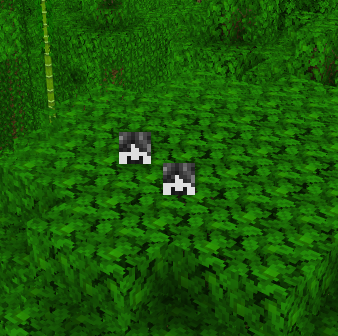
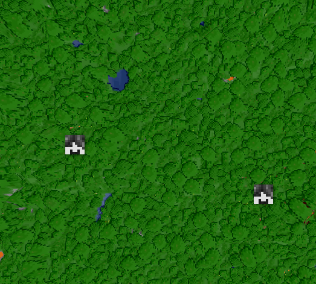

# BlueMap Offline Player Markers

Adds markers in the positions where players have logged off to [BlueMap](https://github.com/BlueMap-Minecraft/BlueMap).

| Closeup                                                                         | Faraway                                                                               | 
|---------------------------------------------------------------------------------|---------------------------------------------------------------------------------------|
|  |  |

Compatible with Paper 1.13+, just like BlueMap itself.

To reload this plugin, just reload BlueMap itself with `/bluemap reload`.

If you want specific players to not get offline markers, you can hide them from BlueMap
by using a plugin like [BlueMapPlayerControl](https://github.com/TechnicJelle/BlueMapPlayerControl) (also by me).

For a Fabric port of this plugin, please see [this fork by syorito-hatsuki](https://github.com/syorito-hatsuki/BlueMapOfflinePlayerMarkersFabric)

## [Click here to download!](../../releases/latest)

## [TODO list](../../projects/1?fullscreen=true)

## Support

To get support with this plugin, join the [BlueMap Discord server](https://bluecolo.red/map-discord)
and ask your questions in [#3rd-party-support](https://discord.com/channels/665868367416131594/863844716047106068). You're welcome to ping me, @TechnicJelle.

## Special thanks to

[Seercat3160](https://github.com/Seercat3160), [Mark-255](https://github.com/Mark-225),
[elsing](https://github.com/elsing), [LOOHP](https://github.com/LOOHP)
and [Blue](https://github.com/TBlueF) for their contributions to the project!

[pop4959](https://github.com/pop4959/BlueMap-Essentials), [JotaFaD](https://github.com/JotaFaD/CivsExtras)
and [YouHaveTrouble](https://github.com/YouHaveTrouble/ServerBasics/blob/a61de3f4964df8764ca15b3562a3c9227f0459ea/src/main/java/me/youhavetrouble/serverbasics/NMSHandler.java#L63) for their
open-source plugins that gave me great examples to learn from.\
And [TBlueF](https://github.com/TBlueF) of course for his amazing plugin and fast support with my silly questions!
